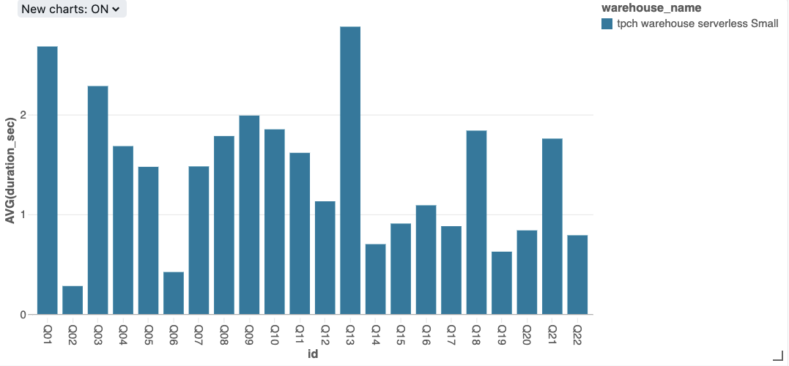

# Metimur 
Databricks Serverless SQL Accelerator


## Table of Contents
1. [About the Accelerator](#about-the-accelerator)
2. [Requirements](#requirements)
3. [Quickstarts](#quickstarts)
    * [Quickstarts DB](#quickstarts-db)
    * [Quickstarts Restapi](#quickstarts-restapi)
4. [Advanced](#advanced)

## About the Accelerator

* Automating data generation and query benchmarking
* Removing dependencies on customer data access
* Suggesting optimization techniques
* Benchmark queries performance in Databricks Serverless SQL

This accelerator utilizes DatabricksLabs [dbldatagen](https://github.com/databrickslabs/dbldatagen) package for DataFrame generation, and [Beaker](https://github.com/goodwillpunning/beaker) package for query benchmarking 


## Requirements
* Databricks workspace with Serverless and Unity Catalog enabled
* Python 3.9+

## Quickstarts

### Quickstarts DB

The **quickstart_db** notebook provides a convenient way to execute queries concurrently using [Databricks SQL Connector](https://docs.databricks.com/en/dev-tools/python-sql-connector.html) with ODBC driver on **Databricks worksparce** with existing data, and easily benchmark the duration of each query on Serverless, Pro, and Serverless warehouses.  

>**Note**: You should have **existing data** available in the workspace to proceed. If you don't have available data, the default data used in the notebook is `tpch` data in `samples` catalog along with tpch sample queries in `queries` folder of this repo. If you want to use TPCH and TPCDS data with different scale factor, or generate your own data with defined schema, go to **Advanced** section.


#### Setup

You should run this notebook on existing Databricks workspace.

Clone this repo and add the repo to your Databricks Workspace. Refer to [Databricks Repo](https://docs.databricks.com/en/repos/repos-setup.html) for instruction on how to create Databricks repo on your own workspace

1. Upload your query file to `queries` folder, refer to `tpch` folder for sample queries.
2. Go to `quickstarts_db` notebook
3. Specify parameters
4. Click `Run/Run All`

#### Output

With one-warehouse option, you can view the average duration of each query in the query file



When the multiple warehouses option is enabled, three types of warehouses - serverless, pro, and classic - are automatically generated. They will have the same size based on warehouse_size widget and their names will be prefixed with the warehouse_name widget.


**The query duration is fetched from Query History API and should be consistent with query duration on Databricks monitoring UI**

### Quickstarts RestAPI

The `quickstarts_resapi_standalone` lets you:

* execute queries with parameters on Databricks SQL warehouse from your local machine using [Databricks Execute SQL API](https://docs.databricks.com/api/workspace/statementexecution/executestatement). 
* download the data to csv files
* and benchmark query duration from Query History API

**Repreqs**:
* Python 3.9+ installed on your local machine
* Access to Databricks workspace, and permission to create Personal Access Token
* Access to an existing Databricks SQL Warehouse

#### Set up

1. Clone this repo to your local machine, in your terminal `cd <cloned directory>`

2. Upload your query file to `queries` folder, replace any required params with `:param_name`. Refer to `tpch_w_param.sql` file for sample queries with params or Databricks [API doc](https://docs.databricks.com/api/workspace/statementexecution/executestatement)

3. Duplicate the .env_sample file, rename the copy to .env, and populate it with your specific environment variables.
```
HOST=xxxxx.cloud.databricks.com
AUTH_TOKEN=dapixxxxxxxxxxxxxxxxxxxxxxxxxxxxxxxxxxxxxx
WAREHOUSE_ID=475xxxxxx
CATALOG=samples
SCHEMA=tpch
USER_NAME = ""
```
<details>
<summary>Instructions to obtain the above values</summary>

* HOST: aka [Workspace Instance Name](https://docs.databricks.com/en/workspace/workspace-details.html) can be located on the browser when you login to Databricks workspace

* AUTH_TOKEN: aka Databricks [personal access token](https://docs.databricks.com/en/workspace/workspace-details.html)

* WAREHOUSE_ID: This warehouse should be already exists in your workspace. From Databricks workspace, go to `SQL Warhouses`, choose your warehouse, `Connection details`, the warehouse ID is the last part of HTTP path `/sql/1.0/warehouses/<warehouse_id>` OR create a new warehouse

* CATALOG and SCHEMA: of the tables you want to query

* USER_NAME: the user name you used to access the workspace and run the queries

</details>


4. Create a python virtual environment, and install required packages. In your terminal inside your cloned directory, run the following:
```
python3 -m venv myvenv

source myvenv/bin/activate

pip install -r requirements.txt
```

5. Run the quickstarts file

```
python quickstarts_restapi_standalone.py 
```

#### Output

**Download Example Output**


**Benchmark Example Output**
The average query duration will show in your terminal as below
```
         duration
query            
Q1     811.776923
Q2     657.579487
Q3     420.361538
```


## Advanced 
**(in progress)**

The **advanced** notebook provides a convenient way to:  
1. Generate Data
* Generate your own sample data with available schemas
2. Execute queries concurrently using [Databricks SQL Connector](https://docs.databricks.com/en/dev-tools/python-sql-connector.html) on existing data, and easily benchmark the duration of each query on Serverless, Pro, and Serverless warehouses