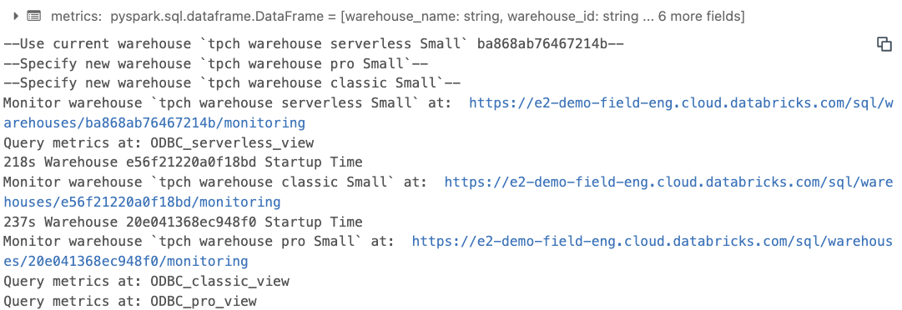
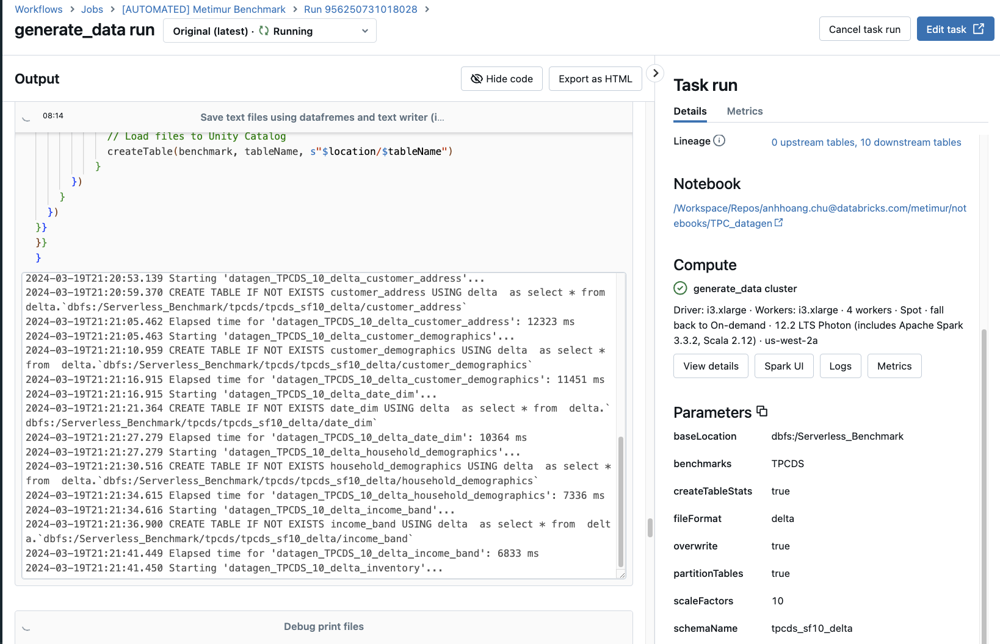
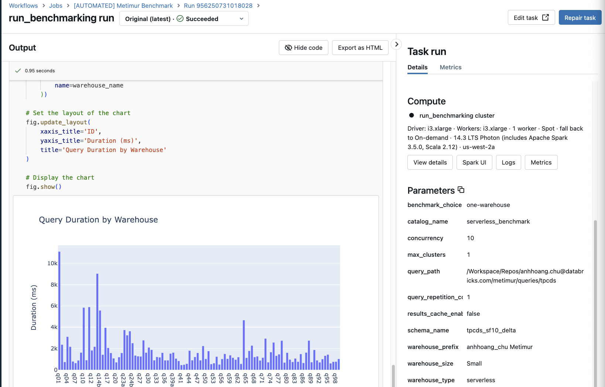
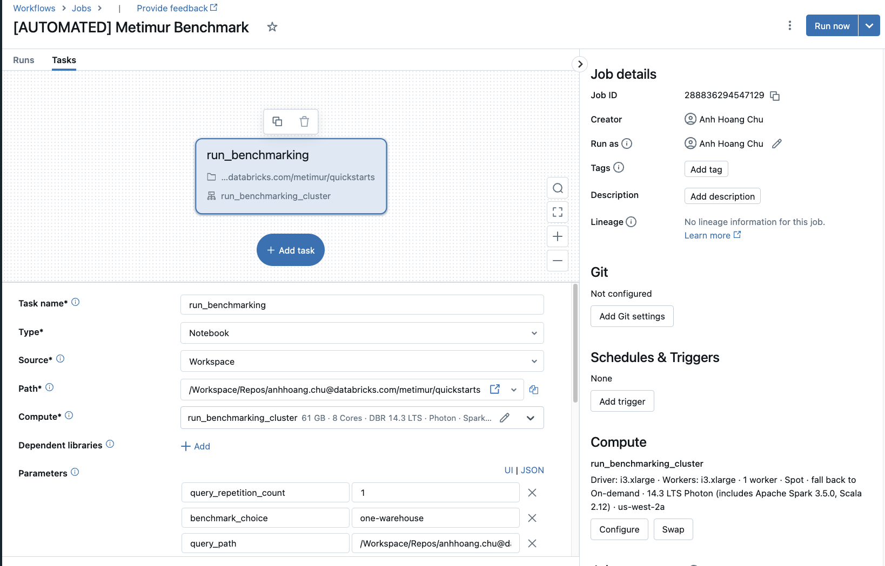
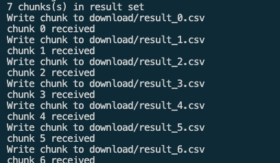

# Metimur (Databricks SQL Benchmark Accelerator)

"Metimur", translating to "We Measure", is designed with the following key objectives:

- Streamlining the process of data generation and query benchmarking
- Evaluating query performance in Databricks SQL warehouses
- Eliminating reliance on sensitive data by creating synthetic data based on table schemas

This accelerator utilizes DatabricksLabs [dbldatagen](https://github.com/databrickslabs/dbldatagen) library for DataFrame generation, and [Beaker](https://github.com/goodwillpunning/beaker) library for query benchmarking 


# Table of Contents
- [Requirements](#requirements)
- [When to Use](#when-to-use)
    - [Use Case 1: Benchmark existing data](#use-case-1-benchmark-existing-data)
        - [Getting Started](#getting-started)
        - [Output](#output)
    - [Use Case 2: Generate Synthetic Data based on table schemas](#use-case-2-generate-synthetic-data-based-on-table-schemas)
        - [Getting Started](#getting-started-1)
        - [Output](#output-1)
    - [Use Case 3: Generate TPC Data](#use-case-3-generate-tpc-data)
        - [Getting Started](#getting-started-2)
        - [Output](#output-2)
    - [Extras: Use Databricks Execute SQL API](#extras-use-databricks-execute-sql-api)
        - [Getting Started](#getting-started-3)
        - [Output](#output-3)
- [Limitations](#limitations)

# Requirements
* Databricks workspace with Serverless and Unity Catalog enabled
* Python 3.9+

# When to Use

## Use Case 1: Benchmark existing data
You have existing data in Databricks workspace and you want to compare query performance across different Databricks SQL warehouse types or sizes with different level of concurrency 

The **quickstart** notebook provides a convenient way to execute queries concurrently using [Databricks SQL Connector](https://docs.databricks.com/en/dev-tools/python-sql-connector.html) with ODBC driver on **Databricks workspace** with existing data, and easily benchmark the query duration on Serverless, Pro, and Classic warehouses.  

>**Note**: You should have **existing data** available in the workspace to proceed. If you don't have available data, the default data used in the notebook is `tpch` data in `samples` catalog along with tpch sample queries in `queries` folder of this repo. If you want to use TPCH and TPCDS data with different scale factor, or generate your own data with defined schema, go to **Advanced** notebook.

### Getting Started

Clone this repo and add the repo to your Databricks Workspace. Refer to [Databricks Repo](https://docs.databricks.com/en/repos/repos-setup.html) for instruction on how to create Databricks repo on your own workspace

1. Open **quickstarts** notebook on Databricks workspace.
2. Follow the instruction in the notebook
3. Click `Run/Run All`

### Output

1. With **one-warehouse** benchmark option, you can view the average duration of each query


2. With **multiple-warehouses** benchmark option, three types of warehouses - serverless, pro, and classic - are automatically generated. They will have the same size based on warehouse_size widget and their names will be prefixed with the warehouse_prefix widget.




3. With **multiple-warehouses-size** benchmark option, you can choose multiple warehouse sizes from the drop down **warehouse_size** widget. These warehouse will be created with have the same type based on **warehouse_type** widget and their names will be prefixed with the **warehouse_prefix** widget.


**Note: The query duration is fetched from Query History API and should be consistent with query duration on Databricks monitoring UI**


## Use Case 2: Generate Synthetic Data based on table schemas

You want to generate synthetic data based on table schemas, and benchmark the query duration at different concurrency levels on Databricks SQL Warehouses

### Getting Started

Clone this repo and add the repo to your Databricks Workspace. Refer to [Databricks Repo](https://docs.databricks.com/en/repos/repos-setup.html) for instruction on how to create Databricks repo on your own workspace

1. Open **advanced** notebook on Databricks workspace.
2. Run each cell in "Set Up" section
3. Choose `BYOD` in the drop down **benchmarks** widget
4. Upload your user-defined schema file for each table to the **schemas** folder. Follow the example in **schemas/tpch**. 

    <details>
    <summary>Table Schema Example</summary>
    
    ```json
    {
      "table_name": "customer",
      "rows": 750000,
      "fields": [
        {
          "colName": "c_custkey",
          "colType": "bigint",
          "uniqueValues": 750000,
          "minValue": 1,
          "maxValue": 750000
        },{
          "colName": "c_acctbal",
          "colType": "decimal(18,2)",
          "uniqueValues": 543490,
          "minValue": -999.99,
          "maxValue": 9999.99
        },{
          "colName": "c_mktsegment",
          "colType": "string",
          "uniqueValues": 5,
          "values": [
            "MACHINERY",
            "AUTOMOBILE",
            "BUILDING",
            "HOUSEHOLD",
            "FURNITURE"
          ],
          "weights": [
            20.0,
            20.0,
            20.0,
            20.0,
            20.0
              ]
            }
        ]
    }
    ```
    </detail>

5. Upload the queries to a separate folder under **queries** directory, and provide the path in **Query Path** widget
  * **IMPORTANT!** Ensure your queries follow the specified pattern (put query number between `--` and end each query with `;`). You can put multiple queries in one file or each query in a separate file. Follow **queries/tpch** or **queries/tpcds** folders for example

    ```
    --q1--
    select * from table1;

    --q2--
    select * from table2;
    ```

### Output

1. An automated Workflow job is created with 2 tasks: Generate_Data and Run_Benchmarking


2. In **generate_data** task, data are generated in `serverless_benchmark` catalog


3. In the **run_benchmarking task**, benchmark queries are executed on the generated data


## Use Case 3: Generate TPC Data

You want to test Databricks SQL Warehouses performance at different scale factors of TPC Industry benchmark Data.

### Getting Started

Clone this repo and add the repo to your Databricks Workspace. Refer to [Databricks Repo](https://docs.databricks.com/en/repos/repos-setup.html) for instruction on how to create Databricks repo on your own workspace

1. Open **advanced** notebook on Databricks workspace.
2. Run each cell in "Set Up" section
3. Choose `TPCH` or `TPCDS` in the drop down **Benchmarks** widget and the **Scale Factors**
4. Set the **Query Path** widget to `queries/tpch` or `queries/tpcds`

### Output

1. An automated Workflow job is created with 2 tasks: Generate_Data and Run_Benchmarking

2. In **generate_data** task, TPC data are generated in `serverless_benchmark` catalog. 



3. In the **run_benchmarking task**, benchmark queries are executed on the generated data



**Note**: To avoid re-generate these industry benchmarks data, after data is generated, all users in the workspace will be able to query the tables and run benchmark queries on them. If the schemas and tables already exist, the Generate Data task will be skipped



## Extras: Use Databricks Execute SQL API

You want to use Databricks warehouses from local machine or an application:
* execute queries with parameters on Databricks SQL warehouse from your local machine using [Databricks Execute SQL API](https://docs.databricks.com/api/workspace/statementexecution/executestatement). 
* download the data to csv files
* and aggregate query duration from Query History API


**Repreqs**:
* Python 3.9+ installed on your local machine
* Access to Databricks workspace, and permission to create Personal Access Token
* Access to an existing Databricks SQL Warehouse

### Getting Started

1. Clone this repo to your local machine, in your terminal 
* Go to `cd metimur/extras/quickstarts_restapi_standalone`

2. Upload your query file to `queries` folder, replace any required params with `:param_name`. Refer to `tpch_w_param.sql` file for sample queries with params or Databricks [API doc](https://docs.databricks.com/api/workspace/statementexecution/executestatement)

3. Duplicate the .env_sample file, rename the copy to .env, and populate it with your specific environment variables.
```
HOST=xxxxx.cloud.databricks.com
AUTH_TOKEN=dapixxxxxxxxxxxxxxxxxxxxxxxxxxxxxxxxxxxxxx
WAREHOUSE_ID=475xxxxxx
CATALOG=samples
SCHEMA=tpch
USER_NAME = ""
```

<details>
<summary>Instructions to obtain above parameters</summary>

* HOST: aka [Workspace Instance Name](https://docs.databricks.com/en/workspace/workspace-details.html) can be located on the browser when you login to Databricks workspace

* AUTH_TOKEN: aka Databricks [personal access token](https://docs.databricks.com/en/workspace/workspace-details.html)

* WAREHOUSE_ID: Use an already-existed warehouse or create a new one in your Databricks workspace before proceeding. From Databricks workspace, go to `SQL Warhouses`, choose your warehouse, `Connection details`, the warehouse ID is the last part of HTTP path `/sql/1.0/warehouses/<warehouse_id>`

* CATALOG and SCHEMA: of the tables you want to query

* USER_NAME: the user name you used to access the workspace and run the queries

</details>

4. Create a python virtual environment, and install required packages. In your terminal inside your cloned directory, run the following:
```
python3 -m venv myvenv

source myvenv/bin/activate

pip install -r requirements.txt
```

5. Run the `quickstarts_restapi_standalone` file

```
python quickstarts_restapi_standalone.py 
```

### Output

**Download Example Output**



**Benchmark Example Output**
The average query duration will show in your terminal similar to below:
```
         duration
query            
Q1     811.776923
Q2     657.579487
Q3     420.361538
...
```

# Limitations

- This tool is designed to support only Unity Catalog managed tables. For ease of use, a default Unity Catalog named `serverless_benchmark` is automatically created to store all TPC and user-generated synthetic data.
- All workspace users are granted `USE CATALOG`, `CREATE SCHEMA`, `USE SCHEMA`, `CREATE TABLE` permissions on the catalog, as well as `SELECT` permission to query TPC Data tables. Refer [Unity Catalog Privileges and securable objects](https://docs.databricks.com/en/data-governance/unity-catalog/manage-privileges/privileges.html#unity-catalog-privileges-and-securable-objects)
- If TPC data already exist, they won't be regenerated.
- In the Synthetic data generation mode, query permissions are exclusively granted to the user who creates the user-defined schemas and tables.
- It is recommended to test queries on Databricks before executing them for benchmarking. Currently, there is no automatic conversion of queries from other EDW systems to Databricks query syntax. Therefore, ensure that the queries for benchmarking are compatible with Databricks. 
- It is highly recommended to optimize generated Delta Tables using optimization techniques such as [Liquid Clustering](https://docs.databricks.com/en/delta/clustering.html) or [partitioning + Zordering](https://docs.databricks.com/en/delta/data-skipping.html#what-is-z-ordering) on Databricks before executing them for benchmarking. Currently, there is no automatic conversion of queries from other EDW systems to Databricks query syntax. Therefore, ensure that the queries for benchmarking are compatible with Databricks.