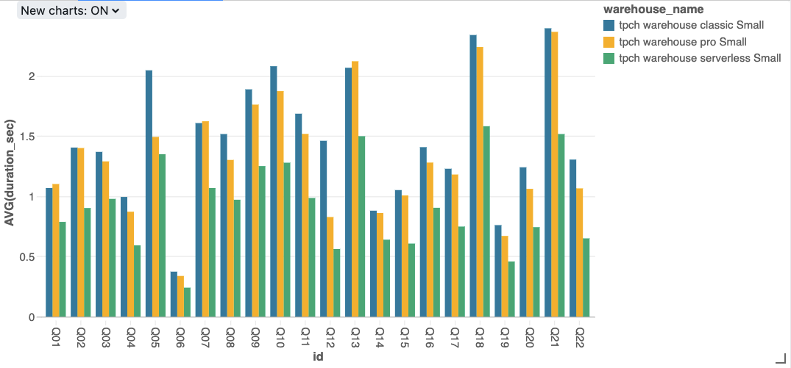
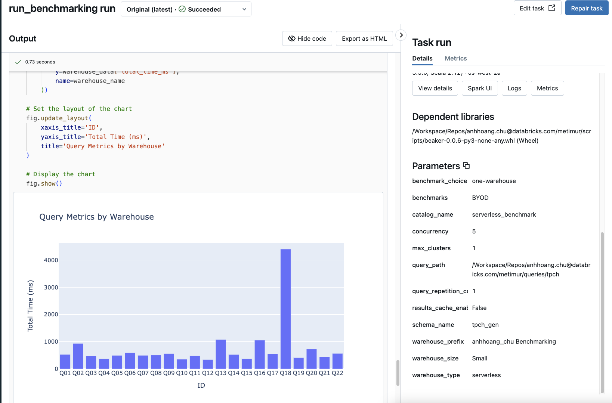
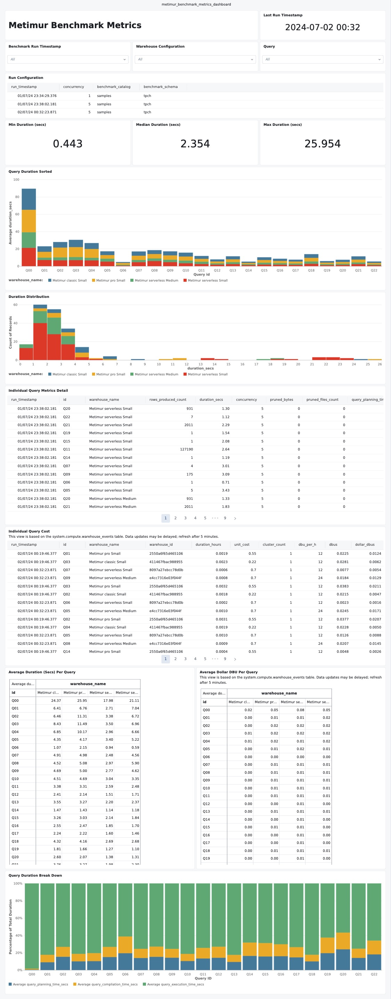

# Metimur (Databricks SQL Benchmark Accelerator)

"Metimur", translating to "We Measure", is designed with the following key objectives:

- Streamlining the process of data generation and query benchmarking
- Evaluating query performance in Databricks SQL warehouses
- Eliminating reliance on sensitive data by creating synthetic data based on table schemas

This accelerator utilizes DatabricksLabs [dbldatagen](https://github.com/databrickslabs/dbldatagen) library for DataFrame generation, [Beaker](https://github.com/goodwillpunning/beaker) library for query benchmarking, and [TPC-DS Runner](https://github.com/AbePabbathi/lakehouse-tacklebox/tree/main/30-performance/TPC-DS%20Runner) created by mberk06

Demo Recording: https://www.youtube.com/watch?v=JBlqoay8_3o


# Table of Contents
- [Requirements](#requirements)
- [When to Use](#when-to-use)
    - [Use Case 1: Benchmark existing data](#use-case-1-benchmark-existing-data)
        - [Getting Started](#getting-started)
        - [Output](#output)
    - [Use Case 2: Generate Synthetic Data based on table schemas](#use-case-2-generate-synthetic-data-based-on-table-schemas)
        - [Getting Started](#getting-started-1)
        - [Output](#output-1)
    - [Use Case 3: Generate TPC Data](#use-case-3-generate-tpc-data)
        - [Getting Started](#getting-started-2)
        - [Output](#output-2)
    - [Benchmark Output: LakeView Metrics Dashboard](#benchmark-output-lakeview-metrics-dashboard)
- [Limitations](#limitations)

# Requirements
* Databricks workspace with Serverless and Unity Catalog enabled
* Python 3.9+
* Databricks Runtime 14.3+

# When to Use

## Use Case 1: Benchmark existing data
You have existing data in Databricks workspace and you want to compare query performance across different Databricks SQL warehouse types or sizes with different level of concurrency 

The **quickstart** notebook provides a convenient way to execute queries concurrently using [Databricks SQL Connector](https://docs.databricks.com/en/dev-tools/python-sql-connector.html) with ODBC driver on **Databricks workspace** with existing data, and easily benchmark the query duration on Serverless, Pro, and Classic warehouses.  

>**Note**: You should have **existing data** available in the workspace to proceed. If you don't have available data, the default data used in the notebook is `tpch` data in `samples` catalog along with tpch sample queries in `queries` folder of this repo. If you want to use TPCH and TPCDS data with different scale factor, or generate your own data with defined schema, go to **Advanced** notebook.

### Getting Started

Clone this repo and add the repo to your Databricks Workspace. Refer to [Databricks Repo](https://docs.databricks.com/en/repos/repos-setup.html) for instruction on how to create Databricks repo on your own workspace

1. Open **quickstarts** notebook on Databricks workspace.
2. Connect the notebook to Single User Cluster with DBR14.3+ LTS
3. Follow the instruction in the notebook
4. Click `Run/Run All`

### Output

1. With **one-warehouse** benchmark option, you can view the average duration of each query


2. With **multiple-warehouses** benchmark option, three types of warehouses - serverless, pro, and classic - are automatically generated. They will have the same size based on warehouse_size widget and their names will be prefixed with the warehouse_prefix widget.




3. With **multiple-warehouses-size** benchmark option, you can choose multiple warehouse sizes from the drop down **warehouse_size** widget. These warehouse will be created with have the same type based on **warehouse_type** widget and their names will be prefixed with the **warehouse_prefix** widget.


**Note: The query duration is fetched from Query History API and should be consistent with query duration on Databricks monitoring UI**


## Use Case 2: Generate Synthetic Data based on table schemas

You want to generate synthetic data based on table schemas, and benchmark the query duration at different concurrency levels on Databricks SQL Warehouses

### Getting Started

Clone this repo and add the repo to your Databricks Workspace. Refer to [Databricks Repo](https://docs.databricks.com/en/repos/repos-setup.html) for instruction on how to create Databricks repo on your own workspace

1. Open **advanced** notebook on Databricks workspace.
2. Connect the notebook to Single User Cluster with DBR14.3+ LTS
3. Run each cell in "Set Up" section
4. Choose `BYOD` in the drop down **benchmarks** widget
5. Upload your user-defined schema file for each table to the **schemas** folder. Follow the example in **schemas/tpch**. 

    <details>
    <summary>Table Schema Example</summary>
    
    ```json
    {
        "table_name": "customer",
        "rows": 750000,
        "fields": [
            {
                "colName": "c_custkey",
                "colType": "bigint",
                "uniqueValues": null,
                "values": [],
                "minValue": null,
                "maxValue": null
            },
            {
                "colName": "c_mktsegment",
                "colType": "string",
                "uniqueValues": 5,
                "values": [
                    "MACHINERY",
                    "AUTOMOBILE",
                    "BUILDING",
                    "HOUSEHOLD",
                    "FURNITURE"
                ],
                "minValue": null,
                "maxValue": null
            }
        ]
    }
    ```
    </detail>

6. Upload the queries to a separate folder under **queries** directory, and provide the path in **Query Path** widget
  * **IMPORTANT!** Ensure your queries follow the specified pattern (put query number between `--` and end each query with `;`). You can put multiple queries in one file or each query in a separate file. Follow **queries/tpch** or **queries/tpcds** folders for example

    ```
    --q1--
    select * from table1;

    --q2--
    select * from table2;
    ```

### Output

1. An automated Workflow job is created with 2 tasks: Generate_Data and Run_Benchmarking


2. In **generate_data** task, data are generated in `serverless_benchmark` catalog and user-specified schema name


3. In the **run_benchmarking task**, benchmark queries are executed on the generated data




## Use Case 3: Generate TPC Data

You want to test Databricks SQL Warehouses performance at different scale factors of TPC Industry benchmark Data.

### Getting Started

Clone this repo and add the repo to your Databricks Workspace. Refer to [Databricks Repo](https://docs.databricks.com/en/repos/repos-setup.html) for instruction on how to create Databricks repo on your own workspace

1. Open **advanced** notebook on Databricks workspace.
2. Connect the notebook to Single User Cluster with DBR14.3+ LTS
3. Run each cell in "Set Up" section
4. Choose `TPCH` or `TPCDS` in the drop down **Benchmarks** widget and the **Scale Factors**
5. Set the **Query Path** widget to `queries/tpch` or `queries/tpcds`

### Output

1. An automated Workflow job is created with 2 tasks: Generate_Data and Run_Benchmarking

2. In **generate_data** task, TPC data are generated in `serverless_benchmark` catalog and `tpch_{scale_factor}` schema

3. In the **run_benchmarking task**, benchmark queries are executed on the generated data similar to Use Case 2

**Note**: To avoid re-generate these industry benchmarks data, after data is generated, all users in the workspace will be able to query the tables and run benchmark queries on them. If the schemas and tables already exist, the Generate Data task will be skipped

## Benchmark Output: LakeView Metrics Dashboard

For use cases 1 to 3, once the benchmark is finished, the metrics dataframe will be stored in a Delta table for each user (named `serverless_benchmark.default._metimur_metrics_{user_name}`), and an automated dashboard will be generated  to provide information on multiple benchmark runs such as query durations, and query costs.



**Notes:**
* You will need permission to CREATE CATALOG and CREATE SCHEMA in Unity Catalog to proceed
* All users in the workspace can create table in `serverless_benchmark.default`
* Each user will have all benchmark runs saved in Delta table at `serverless_benchmark.default._metimur_metrics_{user_name}`
* Each user will have their dashboard assets saved in their user workspace location

# Limitations

- This tool is designed to support only Unity Catalog managed tables. For ease of use, a default Unity Catalog named `serverless_benchmark` is automatically created to store all TPC and user-generated synthetic data.
- All workspace users are granted `USE CATALOG`, `CREATE SCHEMA`, `USE SCHEMA`, `CREATE TABLE` permissions on the catalog, as well as `SELECT` permission to query TPC Data tables. Refer [Unity Catalog Privileges and securable objects](https://docs.databricks.com/en/data-governance/unity-catalog/manage-privileges/privileges.html#unity-catalog-privileges-and-securable-objects)
- If TPC data already exist, they won't be regenerated.
- In the Synthetic data generation mode, query permissions are exclusively granted to the user who creates the user-defined schemas and tables.
- It is recommended to test queries on Databricks before executing them for benchmarking. Currently, there is no automatic conversion of queries from other EDW systems to Databricks query syntax. Therefore, ensure that the queries for benchmarking are compatible with Databricks. 
- It is highly recommended to optimize generated Delta Tables using optimization techniques such as [Liquid Clustering](https://docs.databricks.com/en/delta/clustering.html) or [partitioning + Zordering](https://docs.databricks.com/en/delta/data-skipping.html#what-is-z-ordering) on Databricks before executing them for benchmarking. Currently, there is no automatic data layout optimization techniquies applied to generated data
